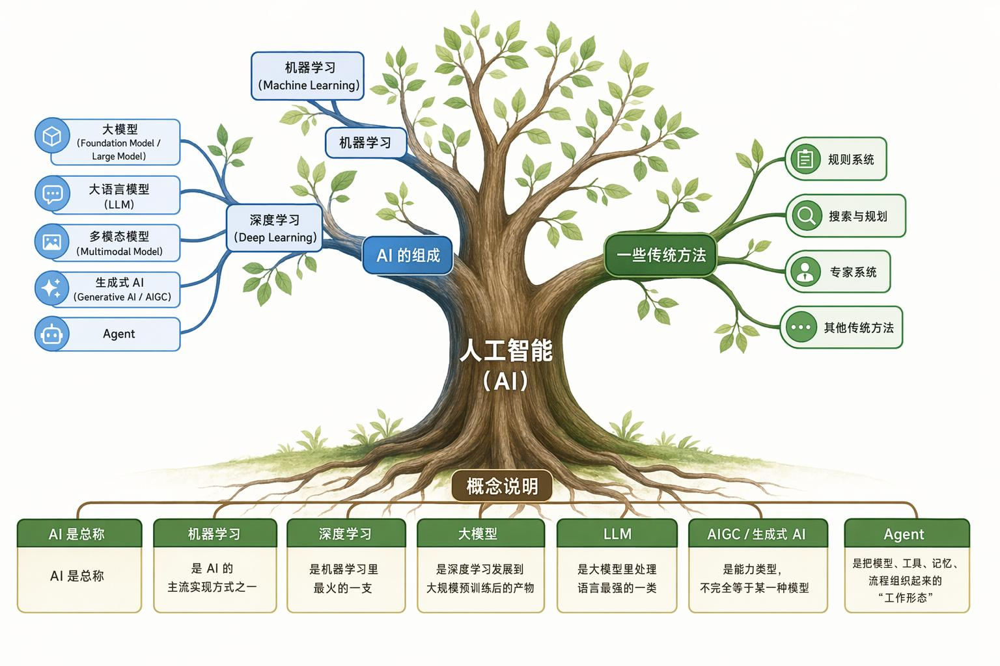

# AI通识简述

---

<!-- TOC -->
* [AI通识简述](#ai通识简述)
  * [发展编年史](#发展编年史)
  * [核心概念](#核心概念)
    * [人工智能（AI）](#人工智能ai)
    * [机器学习（Machine Learning）](#机器学习machine-learning)
    * [深度学习（Deep Learning）](#深度学习deep-learning)
    * [神经网络（Neural Network）](#神经网络neural-network)
    * [大模型（Large Language Model）](#大模型large-language-model)
    * [大语言模型（Large Language Model）](#大语言模型large-language-model)
    * [生成式 AI（Generative AI，AIGC）](#生成式-aigenerative-aiaigc)
    * [多模态 AI（Multimodal AI）](#多模态-aimultimodal-ai)
  * [术语词典](#术语词典)
<!-- TOC -->

---

## 发展编年史
- **AI 诞生前夜：理论基础形成期（1940s–1955）**：机器能否模拟人的思维、推理与学习。
- **AI 正式诞生：符号主义黄金起点（1956–1969）**：知识可以被编码为规则、逻辑和符号操作。
- **第一次 AI 寒冬：高预期后的挫折（1970s）**：面对现实世界的复杂性，表现非常脆弱。语言理解、视觉识别、通用推理都远未达到宣传中的水平。
- **专家系统时代：知识工程兴起（1970s–1980s）**：转向更现实、更垂直的方向：专家系统。思维遗产：流程控制、规则约束、人工审核、知识库治理。今天的大模型系统并不是纯生成式的，往往也要和规则系统一起工作。
- **第二次 AI 寒冬：规则系统天花板显现（late 1980s–1990s）**：企业发现，这些系统在小范围内有效，但维护成本过高，规模化落地困难。
- **机器学习崛起：从 “写规则” 到 “让机器从数据中学”（1990s–2000s）**：研究重点从“人工编写知识和规则”逐渐转到 “让模型从数据中学习规律”。沉淀了现代工业界的大多数思维方式 —— 数据集、特征工程、训练 / 验证 / 测试、指标评估。
- **深度学习复兴：神经网络重新登场（2006–2011）**：如果数据足够多、模型足够大、算力足够强，神经网络可能比手工特征更强。
- **深度学习大爆发：感知智能突破（2012–2016）**：先在“感知”和“模式识别”上取得突破，也就是说，机器先学会“看、听、识别”，再逐渐走向 “理解、生成、规划”。
- **Transformer 时代开启：大模型技术底座出现（2017–2021）**：不再为每个任务单独训练一个小模型，而是先训练一个大规模通用模型，再通过微调、提示或工具调用去适配具体任务。
- **生成式 AI 爆发：从 “识别世界” 到 “生成世界”（2022–2023）**： 从辅助识别进一步走向辅助创作、辅助决策和辅助开发。
- **多模态与 Agent 发展：AI 从单轮回答走向可执行系统（2024–至今）**：多模态模型的发展，让 AI 从只处理文本扩展到真正理解复杂生产资料；而 Agent 化的发展，则让 AI 从 “回答问题” 走向 “完成任务”。

---

## 核心概念
### 人工智能（AI）
- **定义**：是指机器模拟人类智能、学习和决策的能力。
- **能力项**：
  - **感知**：看图、听声音、识别视频
  - **理解**：理解语言、图像、结构化信息
  - **推理**：做判断、分析原因、拆解问题
  - **决策**：给出建议或选择
  - **生成**：写文本、画图、做视频、写代码
  - **行动**：调用工具、执行流程、完成任务

### 机器学习（Machine Learning）
- **定义**：是指机器通过数据和算法学习，自动改进性能的能力。
- **能力项**：
  - **数据驱动**：从数据中提取信息
  - **模型训练**：使用数据训练模型
  - **模型评估**：评估模型性能
  - **模型部署**：将模型应用于实际场景

### 深度学习（Deep Learning）
- **定义**：是机器学习的一个分支，核心是通过多层神经网络学习，自动提取特征的能力。
- **能力项**：
  - **特征提取**：自动从数据中提取特征
  - **模式识别**：识别复杂模式
  - **决策支持**：辅助决策过程
- **为什么叫 “深度”？**：因为神经网络的层数更多，模型可以从低层特征逐步抽象到高层特征。
  - 比如识别任人物
    - 底层先学边缘和颜色
    - 中层学局部结构，如眼睛、鼻子
    - 高层学整体脸部模式
 - **应用领域**： 
   - 图像识别
   - 目标检测
   - 人脸识别
   - 语音识别
   - 机器翻译
   - 文本理解
   - 内容生成

### 神经网络（Neural Network）
- **定义**：深度学习的核心就是神经网络，机器通过模拟人类神经元的连接和信息处理，实现学习和决策的能力。
- **本质**： 一层层参数化计算结构，把输入逐步变成输出。
  1. 神经网络通过大量参数来表示 “经验”
  2. 训练过程就是不断调整参数，让输出更接近正确答案
  3. 数据越复杂、任务越复杂，通常需要更强的网络结构 

### 大模型（Large Language Model）
- **定义**：在超大规模数据上预训练出来、可迁移到很多任务上的通用模型底座。
- **特点**：
  - 参数规模大
  - 训练数据规模大
  - 泛化能力强
  - 可迁移性强
  - 能通过 Prompt 完成很多任务
  - 可以作为很多应用的底层引擎

### 大语言模型（Large Language Model）
- **定义**：是大模型中专门处理语言的一类模型。
- **核心能力**：理解和生成自然语言。
- **应用领域**：
  - 问答、写作、总结 、翻译、改写、提取信息
  - 代码生成
  - 规划任务
  - 解释文档

### 生成式 AI（Generative AI，AIGC）
- **定义**：能够生成新内容的 AI。它是一种 “能力类型”，不是单一模型。是能力形态，不是模型类别本身。
- **应用领域**：
  - 图像生成
  - 语音生成
  - 视频生成
  - 文本生成
  - 代码生成

### 多模态 AI（Multimodal AI）
- **定义**：能够同时处理多种模态数据的 AI。

---

## 术语词典
- **AI**：总称，目标是让机器表现出智能行为。
  
- **机器学习**：实现 AI 的方法之一，让机器从数据中学规律
- **深度学习**：机器学习的一支，用多层神经网络处理复杂数据
- **神经网络**：模拟人类神经元的连接和信息处理，实现学习和决策的能力。
  
- **大模型**：深度学习发展到超大规模预训练后的产物，是当前很多 AI 应用的底座
- **LLM**：大语言模型，擅长处理文本
- **多模态模型**：能处理文本、图像、音频、视频等多种输入
- **生成式 AI**：能生成内容的 AI，可能生成文本、图像、视频、音频、代码
  
- **预训练（Pretraining）**：预训练是先在海量通用数据上训练模型，让它获得广泛基础能力。
- **训练（Training）**：让模型从大量数据中学习能力
- **微调（Fine-tuning）**：在已有模型基础上继续训练，让它更适合某个领域或任务
- **监督微调（Supervised Fine-tuning）**：给模型大量 “输入 → 理想输出” 的样例，让它学会按这种方式回答。
- **RLHF（Reward-Learning from Human Feedback，HF）**：通过人类反馈，让模型学会按人类方式回答。
- **推理（Inference）**：模型真正上线使用、输出结果的过程。
- **LoRA（Low-Rank Adaptive Reparameterization）**：轻量微调方法，不改整个大模型，只额外训练一小部分参数，就让模型适配新任务。
- **幻觉（Hallucination）**：模型输出了看似合理但实际错误的信息。
  
- **向量（Vector）**：向量就是一串数字，用来表示内容的语义特征。
- **Embedding**：把文本转换为固定长度的向量表示，也叫嵌入。
- **Embedding Space**：所有嵌入向量组成的空间，也叫嵌入空间。
  
- **温度（Temperature）**：控制模型输出的随机性，值越小越确定，值越大越随机。
- **Top-k**：只保留模型输出的前 k 个 token，其他 token 都会被截断。
- **Top-p**：只保留模型输出的 p 百分比，其他 token 都会被截断。
  
- **Prompt**：给 AI 的输入指令、上下文和约束条件。
- **Context Window**：模型一次只能处理的文本长度，也叫上下文窗口。
- **Token**：模型处理的基本单位，每个字符、每个单词、每个标点符号等。
- **Token Limit**：模型一次只能处理的 token 数量，也叫 token 限制。
- **Tokenization**：把文本转换为 token 序列。
- **Decoding**：把 token 序列转换为文本。
  
- **知识库**：外部资料集合，比如文档、FAQ、规范、表格
- **RAG**：先检索知识库，再让模型基于资料回答
  
- **Workflow**：工作流就是把一个复杂任务拆成多个明确步骤，让 AI 和工具按顺序完成。
  
- **Agent**：让模型不只回答，还能拆任务、调工具、执行流程。
- **Harness**：包裹在 Agent 外层的控制系统，通过任务拆解、上下文管理、状态持久化等机制确保智能体稳定可靠运行。

---