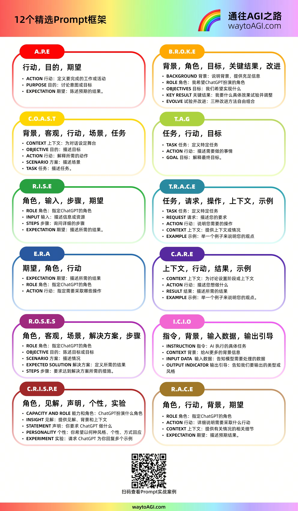

# 提示词工程（Prompt Engineering）


> 定义：发给大模型的指令
> 
> 核心：有效性


--- 


<!-- TOC -->
* [提示词工程（Prompt Engineering）](#提示词工程prompt-engineering)
  * [核心要素](#核心要素)
  * [基础框架](#基础框架)
  * [实用技巧](#实用技巧)
  * [参考文献](#参考文献)
  * [工具/产品](#工具产品)
<!-- TOC -->


---


## 核心要素
- **指令（Instruction）**：给模型下达指令，或者描述要执行的任务；
- **上下文（Context）**：给模型提供额外的上下文信息，引导模型更好地响应；
- **输入数据（Input Data）**：用户输入的内容或问题；
- **输出指示（Output Indicator）**：指定输出的类型或格式；

| 典型问题 | 示例 | 改进方向 |
|----|----|----|
| 过于简短，缺乏信息 | “写篇文章” | 补充主题（如 “写一篇关于‘职场新人沟通技巧’的文章”）、受众（如 “给刚入职的应届生”）、长度（如 “800 字左右”） |
| 混合多个无关任务 | “写一首诗，顺便分析下市场数据，再推荐部电影” | 拆分任务，一次聚焦一个目标（如 “先写一首关于秋天的七言绝句，写完后再分析某产品的 7 月销售数据”） |
| 缺乏风格 / 格式约束 | “总结一本书” | 明确格式（如 “分 3 点总结《活着》的核心主题”）、风格（如 “用简洁的语言，避免剧透”） |
| 隐含模糊需求 | “帮我优化下文案” |  补充具体需求：“优化某奶茶的宣传文案，使其更突出‘低糖’卖点，语言更年轻化” |


---


## 基础框架
- 对提示词的格式和内容做了更明确的定义，比如 Matt Nigh 的 [CRISPE 框架](https://github.com/mattnigh/ChatGPT-Free-Prompt-List)：
  - **CR**： Capacity and Role（能力与角色）。你希望 ChatGPT 扮演怎样的角色。
  - **I**： Insight（洞察力），背景信息和上下文。
  - **S**： Statement（指令），你希望 ChatGPT 做什么。
  - **P**： Personality（个性），你希望 ChatGPT 以什么风格或方式回答你。
  - **E**： Experiment（实验），要求 ChatGPT 为你提供多个答案。

- 云中江树的 [结构化提示词](https://github.com/EmbraceAGI/LangGPT)：
  ```markdown
  # Role: 你的角色名称
  
  ## Profile
  - Author: 你的名字
  - Version: 1.0
  - Language: 中文
  - Description: 清晰的角色描述和核心能力
  
  ### Skill-1
  1. 具体技能描述
  2. 预期行为和输出
  
  ## Rules
  1. 在任何情况下都不要打破角色设定
  2. 不要编造事实或产生幻觉
  
  ## Workflow
  1. 分析用户输入并识别意图
  2. 系统性地应用相关技能
  3. 提供结构化、可操作的输出
  
  ## Initialization
  作为 <Role>，你必须遵守 <Rules>，你必须用默认 <Language> 与用户对话，你必须向用户问好。然后介绍自己并介绍 <Workflow>。
  ```

  


---


## 实用技巧
1. 角色扮演法：通过赋予角色，约束输出专业性。
  ```markdown
  假设你是一位资深产品经理，请为‘智能保温杯’设计用户需求文档，包含功能列表、用户场景及竞争分析
  ```
2. 反向提示法：明确排除项，避免无效内容。
  ```markdown
  写一篇关于职场晋升的文章，**不要**使用‘努力工作’‘提升能力’等陈词滥调，需提供3个创新性策略
  ```
3. 分步验证法：分阶段验证，确保每步输出符合预期。
  ```markdown
  列出3种常见的网络安全攻击方式"  
  "针对第2种攻击方式（XX攻击），设计一套防御方案"  
  "将防御方案转化为可执行的技术文档，包含部署步骤和代码示例"  
  ```
4. 格式约束法：强制结构化输出，便于后续处理。
  ```markdown
  用思维导图格式梳理‘人工智能发展历程’，节点包含：  
  - 早期理论（1950-1970）  
  - 寒冬期（1970-1980）  
  - 突破（1980-2010）  
  - 爆发（2010-至今）"  
  ```
5. 示例 + 任务组合法：提供框架，降低模型理解成本。
  ```markdown
  "参考以下竞品分析模板，完成对‘小红书’和‘抖音’的对比分析：  
  |   维度  |   小红书    |   抖音 |  
  |------- |------------|------------|  
  | 用户画像 | 20-35岁女性 | 18-40岁全人群 |  
  | 内容形式 | 图文笔记为主 | 短视频为主    |  
  | 变现模式 | 种草→电商   | 广告→直播带货  |
  （需补充：社交属性、算法机制、品牌合作案例）"
  ```

- [大模型对prompt开头和结尾的内容更敏感，把重要的prompt写在最前面或者最后面](../papers/Lost-in-the-Middle-How-Language-Models-Use-Long-Contexts.pdf)
- [OpenAI API 进行提示词工程的最佳实践](https://help.openai.com/zh-hans-cn/articles/6654000-best-practices-for-prompt-engineering-with-the-openai-api)
- [OpenAI：GPT 最佳实践中文大白话版本_未来力场编译](../papers/openai-gpt-best-practices-zh.pdf)


---


## 参考文献
- [提示工程学习笔记](https://www.aneasystone.com/archives/2024/01/prompt-engineering-notes.html)
- [吴恩达prompt工程学习笔记](https://waytoagi.feishu.cn/wiki/PuBWwlhFriob86ki6OecxwqznNW)


---


## 工具/产品
- 生成&优化&批量：[火山引擎-PromptPilot](https://promptpilot.volcengine.com/home)
- 提示词模板
  - https://promptport.ai/
  - https://www.aishort.top/
  - https://promlib.com/
  - [LangGPT — 让每个人都能创建高质量提示词](https://github.com/langgptai/LangGPT)


---