# [Transformer](https://arxiv.org/abs/1706.03762)

> 2017年，Google AI团队提出了Transformer模型，主要致力于在序列建模中提升并行性与长距离依赖建模能力,摆脱对循环与卷积的依赖。

----


<!-- TOC -->
* [Transformer](#transformer)
  * [概述](#概述)
  * [算法原理](#算法原理)
    * [编码器（Encoder）/ 解码器（Decoder）](#编码器encoder-解码器decoder)
    * [词嵌入（Word Embedding / Token Embedding）](#词嵌入word-embedding--token-embedding)
    * [位置编码（Positional Encoding）](#位置编码positional-encoding)
    * [自注意力机制（Self-Attention）](#自注意力机制self-attention)
      * [单头注意力（Single-Head Attention）](#单头注意力single-head-attention)
      * [多头注意力（Multi-Head Attention）](#多头注意力multi-head-attention)
      * [掩码注意力机制（Masked Attention）](#掩码注意力机制masked-attention)
      * [交叉注意力机制（Cross-Attention）](#交叉注意力机制cross-attention)
    * [层归一化（Layer Normalization）](#层归一化layer-normalization)
    * [前馈神经网络（Feed Forward Neural Network, FFN）](#前馈神经网络feed-forward-neural-network-ffn)
    * [全连接层 / 线性层（Linear）](#全连接层--线性层linear)
    * [Softmax](#softmax-)
<!-- TOC -->


---


## 概述
- **背景**：
  - **循环神经网络(RNN)系列的问题**：核心短板是时序递归依赖。即便 LSTM/GRU 通过门控机制缓解了梯度消失，仍然存在几个结构性问题
    - **难以并行**：时间步之间有严格依赖。
    - **长程依赖衰减**：虽然比 vanilla RNN 好，但仍不理想。
    - **路径长度过长**：序列中远距离 token 之间的信息交互要经过多步传播。
    - **训练效率受限**：对硬件不友好，扩展到超大数据集成本高。
  - **卷积神经网络(CNN)系列的问题**：可以提高并行性，但其局部感受野决定了：
    - **无法建模长距离依赖**：卷积核只能在空间上移动，无法跨距离建模。
    - **无法处理序列数据**：卷积层无法直接处理序列数据，需要通过池化层或全局池化层转换为一维向量。
    - **无法处理长序列**：长序列会导致内存占用增加，影响训练效率。
- **Transformer**： 
  - **核心思想**：将序列建模从基于递归状态传播，转为基于全局内容交互。
  - **核心组件**：引入了自注意力机制，能够建模长距离依赖。对每个位置，模型不再只依赖前一时刻隐藏状态，而是直接读取整个上下文，并为不同位置分配不同权重。
  - **核心优势**：任意两个 token 的依赖路径长度从 O (n) 缩短为 O (1) 的 “直接交互”。
    - **并行性**：自注意力机制允许模型并行处理序列中的所有位置，无需依赖前一时刻的隐藏状态。
    - **长距离依赖**：能够建模序列中远距离 token 之间的信息交互，而无需通过多步传播。
    - **训练效率**：通过并行计算和层归一化，Transformer 能够有效处理长序列，而无需增加训练时间。
  - **主要工作**：
    - **结构**：利用编码器与解码器的结构。
    - **三种注意力**：编码器多头自注意力、交叉注意力、 解码器多头自注意力(含因果掩码)。
    - **位置信息**：用位置编码赋予词向量序列信息。
    - **残差连接+层归一化+前馈网络(FFN)**:形成标准层块,稳定深层训练。
  - **架构**
    1. **Token Embedding**：输入 token 被映射到连续向量空间，形成语义表示的初始状态。
    2. **Positional Encoding**：位置编码赋予词向量序列信息，帮助模型理解序列中的位置关系。
    3. ** Multi-Head Self-Attention**：核心模块。每个 token 对所有 token 计算相关性，并进行加权聚合。多头自注意力机制，能够建模长距离依赖。
    4. **Feed-Forward Network (FFN)**：在每个位置，模型通过一个前馈网络对隐藏状态进行非线性变换，以捕获更复杂的特征。
    5. **Residual Connection + Layer Normalization**：通过残差连接和层归一化，确保模型在训练时能够稳定学习，避免梯度消失或爆炸。
    6. **Encoder-Decoder**：将编码器与解码器的结构组合起来，形成完整的 Transformer 模型。
    
    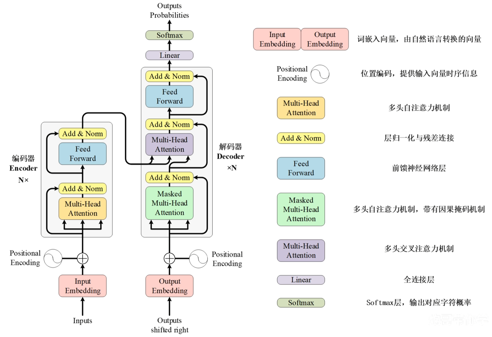


---


## 算法原理
### 编码器（Encoder）/ 解码器（Decoder）
> 编码器将输入序列映射为上下文化语义表示，解码器在因果约束下逐步生成目标序列；在 Encoder-Decoder 架构中，Decoder 通过 Cross-Attention 访问 Encoder 表示，从而实现输入理解与输出生成之间的信息对齐。
- **作用**：编码器负责 “读懂输入”，解码器负责 “生成输出”。
- **结构**：
  - **多层**：每个层包含多个自注意力头、前馈网络、残差连接、层归一化。
  - **并行**：每个位置的处理是并行的，无需依赖前一时刻的隐藏状态。
- **核心组件**：

  | 模块 | Encoder | Decoder |
  |---|---|---|
  | 主要作用 | 理解输入 | 生成输出 |
  | 输入 | 源序列 | 右移后的目标序列 |
  | 第一层注意力 | Self-Attention	| Masked Self-Attention |
  | 是否能看未来 | 通常可以看完整输入 | 不能看未来 token |
  | 是否读取 Encoder 输出 | 不需要 | 通过 Cross-Attention 读取 |


### 词嵌入（Word Embedding / Token Embedding）
> 词嵌入是将离散 token 映射为连续向量空间表示的参数化查表层，其目标是为神经网络提供可学习的输入表示；
> 传统静态词嵌入强调词级分布式语义，而现代 Transformer 中的 embedding 更多是上下文化表示的起点，而非最终语义表示。
- **作用**：把 “词” 转换成一组可计算的数字向量，让模型能够处理语言。使得：
  - 语义相近的词，向量通常更接近。
  - 语义差异大的词，向量通常更远。
  - 词与词之间的关系可以被数学运算表达。
- **核心思想**：如果两个词经常出现在相似上下文里，它们的向量表示就应该更相近。
- **本质**：可训练的查表矩阵。
  - 行数 = 词表大小。
  - 列数 = 向量维度。
  ```python
  nn.Embedding(vocab_size, dim)
  nn.Embedding(32000, 512) # 词表大小为32000, 向量维度为512
  ```
- **传统静态词嵌入局限**：
  -  **一词多义问题**：一个固定向量，这就很难同时表达不同语境中的含义，如“苹果”，可能表示水果、公司、品牌等。
  -  **上下文不敏感**：传统 embedding 通常是静态的：如“bank” 在 “river bank” 和 “bank account” 里向量一样，但实际语义不同
  -  **词表外问题**：如果一个词没在训练词表里出现过，传统词嵌入处理会比较困难。
- **上下文化表示**：
  - **演进**：因为静态词嵌入不够用，后来 NLP 逐渐转向上下文化表示。也就是说： 同一个 token 不同句子里得到的表示可以不同。
  - **核心思路**：BERT（Bidirectional Encoder Representations from Transformers，双向编码器表示从变换器）通过深层双向 Transformer 生成上下文化词表示，使同一个词在不同上下文中的向量不同。
    - **Embedding 层提供初始表示**：每个 token 被映射到连续向量空间，形成语义表示的初始状态。
    - **Transformer 层不断把它变成上下文化表示**：通过多层 self-attention 层，模型能够捕获 token 之间的上下文依赖。
  - **词嵌入、位置编码、上下文化表示三者关系**：词嵌入负责 “身份”，位置编码负责 “顺序”，上下文化表示负责 “语境中的含义”。
    - 词嵌入告诉模型： 这个 token 是什么。
    - 位置编码 / RoPE（Relative Position Embedding，相对位置编码） 告诉模型： 这个 token 在哪里。
    - Transformer 输出表示告诉模型： 这个 token 在当前上下文里是什么意思。
- **代码示例**：
  ```python
  import torch
  import torch.nn as nn

  # 词表大小 10000, 向量维度 256
  embedding = nn.Embedding(num_embeddings=10000, embedding_dim=256)

  # 输入4个 token
  token_ids = torch.tensor([[12, 45, 78, 90]])
  x = embedding(token_ids)

  # 输出形状是 [batch, seq_len, dim] = [1, 4, 256]
  print(x.shape)
  ``` 
  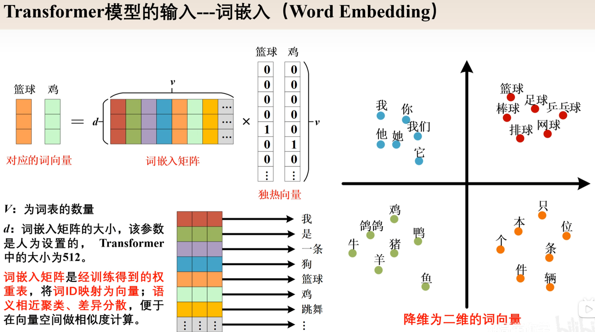

### 位置编码（Positional Encoding）
> 位置编码是 Transformer 中用于注入序列顺序信息的机制；它弥补了 Self-Attention 对排列顺序不敏感的问题，使模型能够建模 token 的绝对位置、相对距离和方向关系。
> 早期 Transformer 采用正余弦绝对位置编码，而现代 LLM 中常见的 RoPE 则通过旋转 Q/K 向量，将相对位置信息融入 Attention 相似度计算。
- **作用**：赋予词向量序列信息，帮助模型理解序列中的位置关系。
- **核心思想**：每个 token 都有一个位置编码，编码了它在序列中的位置。
- **在Transformer 里的位置**：通常在输入进入 Transformer 层之前或 Attention 计算过程中被加入。
  ```text
  输入表示 = Token Embedding + Positional Encoding
  ```
- **类型**：
  - **绝对位置编码**：每个 token 都有一个固定的位置编码，与序列长度无关。
  - **可学习位置编码**：把每个位置的编码当成模型参数，让模型自己学。
  - **相对位置编码**：每个 token 都有一个与它在序列中的位置相关的编码。
  - **旋转位置编码（RoPE，Rotary Positional Embedding）**：代大语言模型中非常常见的位置编码方式，不直接把位置向量加到 token embedding 上，而是对 Attention 里的 Q 和 K 做位置相关的旋转变换。RoPE 将位置信息融入 Query 和 Key 的内积计算中，使注意力分数能够自然包含相对位置信息。
    - 更自然表达相对位置
    - 和 Attention 的 Q/K 相似度计算结合紧密
    - 对长上下文扩展更友好
    - 不只是给 token 加一个位置标签，而是让位置参与注意力关系计算
    ```python
    import torch

    def rotate_half(x):
        x1 = x[..., : x.shape[-1] // 2]
        x2 = x[..., x.shape[-1] // 2 :]
        return torch.cat([-x2, x1], dim=-1)

    def apply_rope(q, k, cos, sin):
        q = q * cos + rotate_half(q) * sin
        k = k * cos + rotate_half(k) * sin
        return q, k
    
    # 在 Attention 中通常是 Q, K, V 分别是 Query, Key, Value 向量的投影表示
    q = q_proj(x)
    k = k_proj(x)
    v = v_proj(x)

    # 应用 RoPE
    q, k = apply_rope(q, k, cos, sin)

    # 计算注意力分数
    scores = q @ k.transpose(-2, -1)
    ```
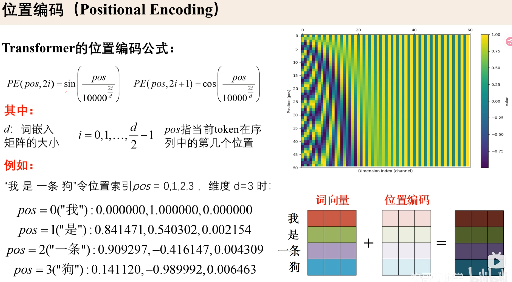

### 自注意力机制（Self-Attention）
- **作用**：核心组件，让序列中的每个 token 都去观察同一序列里的其他 token，并判断哪些 token 对自己最重要，来理解上下文依赖。

- **解决问题**：
  - **长距离依赖**：很远的 token 之间也能直接建立联系。
  - **并行计算**：不需要像 RNN 那样一个 token 一个 token 顺序处理，而是并行处理所有 token。
  - **动态关系建模**：哪些 token 重要，不是人工规定，而是模型根据内容自动学习。
- **Q、K、V**：在自注意力中，每个 token 会被投影成三种向量：Q 负责问，K 负责匹配，V 负责提供内容。
  <div>
    
    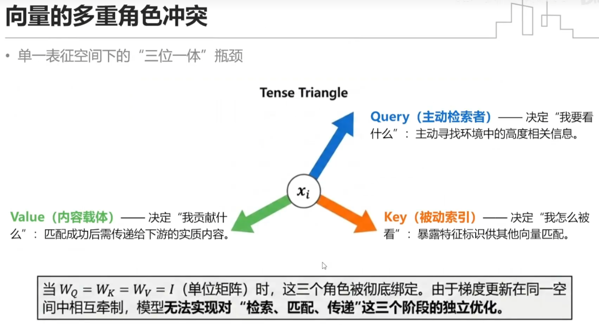
    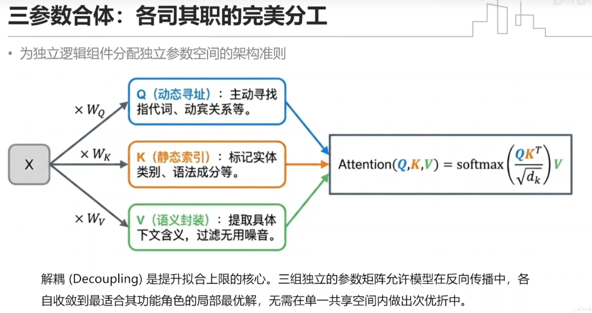
  </div>

#### 单头注意力（Single-Head Attention）
- **核心公式**：整套只做一组 QKV 映射、一组注意力打分，只有 1 个头。
  ```text
  1. 输入 token 表示生成` Q、K、V`。
  2. 用 `QKᵀ` 计算 token 两两相关性。
  3. 除以` sqrt(d_k) `做数值缩放。
  4. 用 `softmax` 得到注意力权重。
  5. 用权重加权汇总 `V`。
  ```
  1. 输入特征 X，分别乘权重矩阵得到： $Q=XW_Q,\ K=XW_K,\ V=XW_V$ <br><br>
  2. 再计算： $\text{Attention}(Q,K,V) = \text{softmax}\left(\frac{QK^\top}{\sqrt{d_k}}\right)V$ <br><br>
- **矩阵计算流程**：
  ```text
  假设输入是：X.shape = [B, T, C]   其中 B 是批量大小，T 是序列长度，C 是向量维度
  
  1，生成`Q、K、V`
  Q = XWq
  K = XWk
  V = XWvq
  形状通常是：
  Q.shape = [B, T, C]
  K.shape = [B, T, C]
  V.shape = [B, T, C]

  2.拆成多个头：如果有 H 个 attention head，每个 head 维度是 D，则：
  C = H × D
  reshape 后：
  Q.shape = [B, H, T, D]
  K.shape = [B, H, T, D]
  V.shape = [B, H, T, D]
  
  3.计算注意力分数：
  scores = QKᵀ / sqrt(D)
  得到：
  scores.shape = [B, H, T, T]
  这个 T × T 矩阵表示：每个 token 对其他所有 token 的关注程度。
  
  4.用 `softmax` 得到注意力权重：
  weights = softmax(scores, dim=-1)
  仍然是：
  weights.shape = [B,H, T, T]
  每一行加起来等于 1，表示当前 token 如何分配自己的注意力。
  
  5. 加权汇总 V：
  out = attn @ V
  得到：
  out.shape = [B, H, T, D]
  最后再拼回：
  out.shape = [B, T, C]
  ```
- **简单例子理解注意力矩阵**：
  ```text
  假设一句话有 4 个 token：
  我 / 喜欢 / 学习 / AI
  
  Self-Attention 会生成一个 4 × 4 的注意力矩阵：
           我     喜欢    学习    AI
  我      0.3    0.4    0.2    0.1
  喜欢     0.2    0.3    0.4    0.1
  学习     0.1    0.2    0.3    0.4
  AI      0.1    0.2    0.5    0.2
  比如最后一行表示：
  “AI” 这个 token 在更新自己的表示时，最关注 “学习”。
  这就是 Self-Attention 的核心直觉：
  每个 token 都会根据上下文，从其他 token 中吸收信息。
  ```
- **代码实现**：
  ```python
  import math
  import torch
  import torch.nn as nn
  import torch.nn.functional as F
  
  
  class SelfAttention(nn.Module):
      def __init__(self, dim):
          super().__init__()
          self.q_proj = nn.Linear(dim, dim)
          self.k_proj = nn.Linear(dim, dim)
          self.v_proj = nn.Linear(dim, dim)
          self.out_proj = nn.Linear(dim, dim)
  
      def forward(self, x, mask=None):
          # x: [B, T, C]
          B, T, C = x.shape
  
          q = self.q_proj(x)  # [B, T, C]
          k = self.k_proj(x)  # [B, T, C]
          v = self.v_proj(x)  # [B, T, C]
  
          scores = torch.matmul(q, k.transpose(-2, -1)) / math.sqrt(C)
          # scores: [B, T, T]
  
          if mask is not None:
              scores = scores.masked_fill(mask == 0, float("-inf"))
  
          attn = F.softmax(scores, dim=-1)
          # attn: [B, T, T]
  
          out = torch.matmul(attn, v)
          # out: [B, T, C]
  
          out = self.out_proj(out)
          return out
  
  
  x = torch.randn(2, 5, 16)  # [B=2, T=5, C=16]
  attn = SelfAttention(dim=16)
  y = attn(x)
  
  print(y.shape)  # torch.Size([2, 5, 16])
  ```
  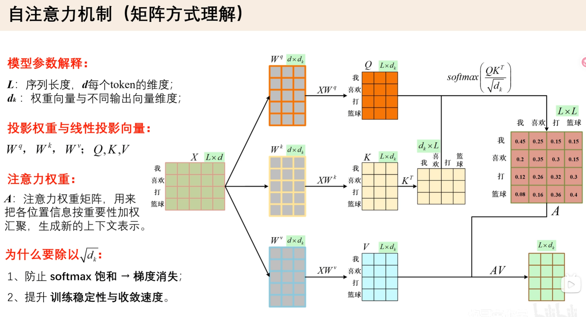
  
#### 多头注意力（Multi-Head Attention）
- **作用**：把单头自注意力并行复制多份，各自独立做注意力计算，最后拼接融合每一份独立的注意力计算单元，就叫一个头（head）。
  - **多粒度、多类型关系建模**：
    - 头 1：关注局部邻近单词（短距离依赖）。
    - 头 2：关注长距离上下文（长依赖）。
    - 头 3：关注语法主谓关系。
    - 头 4：关注指代、同义词语匹配。
  - **拆分降低计算难度，增加表征多样性**。每个头维度变小，打分更聚焦；多组独立注意力提供多路互补特征，模型表达能力大幅提升。
  - **并行计算**：所有头的注意力计算可以矩阵并行完成，不增加串行耗时。
- **核心公式**：
  1. **分头投影**：用大权重矩阵一次性投影出 $h$ 组独立的 $Q_i,K_i,V_i$，每组维度只有 $d_k$； 相当于把原始特征通道均分拆成 $h$ 份，每份交给一个头单独处理。$Q_i = XW_{Q_i},\quad K_i=XW_{K_i},\quad V_i=XW_{V_i},\quad i=1,2,...,h$。
  2. **分头并行计算注意力**：每个头互不干扰，独立算自己的注意力权重与输出：$\text{head}_i = \text{Attention}(Q_i,K_i,V_i)$。
  3. **拼接所有头结果**：把 $h$ 个头的输出在特征维度拼在一起，恢复总维度：$\text{Concat}(\text{head}_1,\text{head}_2,...,\text{head}_h)$。
  4. **最终线性融合**：用一个大权重矩阵 $W_O$ 把拼接后的输出再做一次线性变换，得到最终的注意力输出。$O = \text{Concat}(\text{head}_1,\text{head}_2,...,\text{head}_h) \cdot W_O$
  5. **完整公式**： $\text{MultiHead}(Q,K,V) = \text{Concat}(\text{head}_1,...,\text{head}_h)W_O$
- **代码示例**：
  ```python
  class MultiHeadSelfAttention(nn.Module):
      def __init__(self, dim, num_heads):
          super().__init__()
          assert dim % num_heads == 0
  
          self.dim = dim
          self.num_heads = num_heads
          self.head_dim = dim // num_heads
  
          self.q_proj = nn.Linear(dim, dim)
          self.k_proj = nn.Linear(dim, dim)
          self.v_proj = nn.Linear(dim, dim)
          self.out_proj = nn.Linear(dim, dim)
  
      def forward(self, x):
          # x: [B, T, C]
          B, T, C = x.shape
  
          q = self.q_proj(x)
          k = self.k_proj(x)
          v = self.v_proj(x)
  
          # [B, T, C] -> [B, H, T, D]
          q = q.view(B, T, self.num_heads, self.head_dim).transpose(1, 2)
          k = k.view(B, T, self.num_heads, self.head_dim).transpose(1, 2)
          v = v.view(B, T, self.num_heads, self.head_dim).transpose(1, 2)
  
          scores = torch.matmul(q, k.transpose(-2, -1)) / math.sqrt(self.head_dim)
          # [B, H, T, T]
  
          attn = F.softmax(scores, dim=-1)
  
          out = torch.matmul(attn, v)
          # [B, H, T, D]
  
          out = out.transpose(1, 2).contiguous().view(B, T, C)
          # [B, T, C]
  
          out = self.out_proj(out)
          return out
  ```
  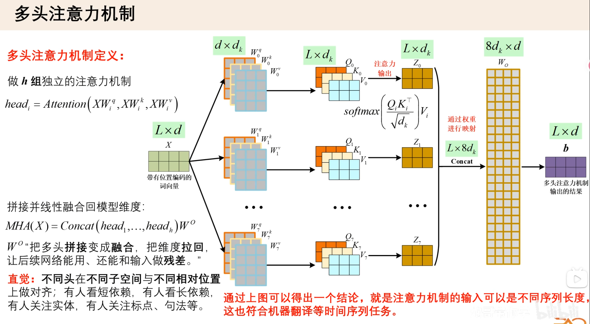

#### 掩码注意力机制（Masked Attention）
- **作用**：在 Attention 计算时，用一个 Mask 矩阵告诉模型：哪些位置可以被关注，哪些位置必须被屏蔽。
  - **未来 token 不能看**：用于 GPT 类自回归生成模型，当前 token 只能看自己和左边，不能看右边未来内容。
  - **Padding token 不能看**：用于填充序列，保持序列长度一致。`[PAD]` 是无效内容，不应该参与注意力计算。
- **核心公式**：$\text{MaskedAttention}(Q, K, V) = \text{softmax}\left( \frac{QK^\top}{\sqrt{d_k}} + M \right) V$
  - $M$ 是 mask 矩阵，形状为 $T \times T$。
  - 可见位置 $QK^\top$ 会被 $M$ 掩码，导致 $softmax$ 输出为 $0$，即score + 0。
  - 不可见位置通常加 $-\infty$，即score + (-∞)。经过 $softmax$ 后，不可见位置的权重会变成 0，即不参与注意力计算。
- **常见 Mask 类型**：
  - **Padding Mask（填充掩码，应用编码器 Encoder）**：屏蔽无效填充  token。
    ```text
    例如序列：
    句子1：我 喜欢 AI
    句子2：我 今天 正在 学习 Transformer
  
    为了组成 batch，通常会补齐成一样长：
    句子1：我 喜欢 AI [PAD] [PAD]
    句子2：我 今天 正在 学习 Transformer 
  
    这里 [PAD] 只是补位，不是真实内容。
    如果不加 Padding Mask，模型可能会错误地关注 [PAD]。
    ```
  - **Causal Mask（因果掩码，应用解码器 Decoder）**：防止看到未来 token。
    ```text
    例如序列：我 今天 学习 AI
  
    训练时模型要学习：
    看到“我” → 预测“今天”
    看到“我 今天” → 预测“学习”
    看到“我 今天 学习” → 预测“AI”
    ```
  - 其他类型及对比
    
  | 掩码名称  | 对应注意力类型 | 使用模型  | 核心作用  |
  |---|---|---|---|
  | Padding Mask  | 双向 / 单向通用 | 全部 Transformer | 屏蔽填充无效 token  |
  | Causal Mask  | 因果单向自注意力 | GPT、T5/BART Decoder | 禁止偷看未来 token  |
  | Permutation Mask | 置换双流注意力 | XLNet  | 排列式双向建模 |
  | Sliding Window Mask | 局部稀疏注意力 | Longformer | 限制仅邻近 token 交互 |
  | Block Sparse Mask | 分块稀疏注意力 | BigBird | 长文本稀疏加速 |
  | LSH Hash Mask | 哈希分组注意力 | Reformer | 哈希聚类稀疏计算 |
  | PrefixLM 混合掩码 | 半双向注意力 | GLM | 前缀双向、生成单向 |
  | Global Token Mask  |  全局 + 局部混合注意力 | Longformer |  特殊 token 全局连通 |

- **代码示例**：
  ```python
  import math
  import torch
  import torch.nn.functional as F

  B = 2
  H = 4
  T = 5
  D = 8

  q = torch.randn(B, H, T, D)
  k = torch.randn(B, H, T, D)
  v = torch.randn(B, H, T, D)

  # 1. 计算注意力分数
  scores = torch.matmul(q, k.transpose(-2, -1)) / math.sqrt(D)
  # scores: [B, H, T, T]
  
  # 2. 构造 causal mask
  causal_mask = torch.triu(
      torch.ones(T, T, device=q.device, dtype=torch.bool),
      diagonal=1
  )
  # causal_mask: [T, T]
  
  # 3. 应用 mask
  scores = scores.masked_fill(causal_mask, float("-inf"))
  
  # 4. softmax
  attn = F.softmax(scores, dim=-1)
  
  # 5. 加权聚合 V
  out = torch.matmul(attn, v)
  
  print(out.shape)  # [B, H, T, D]
  ```
<div>
  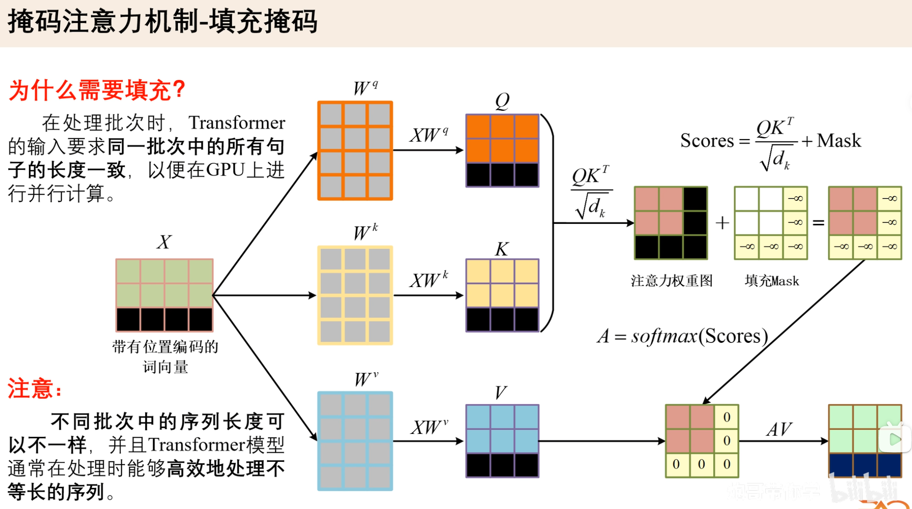
  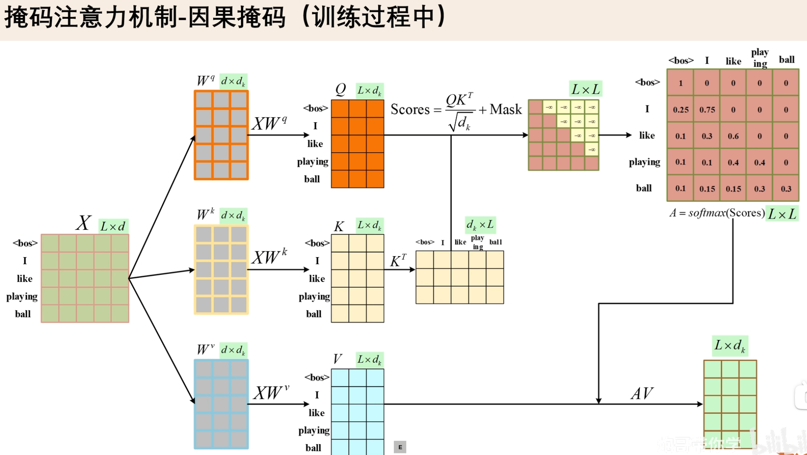
  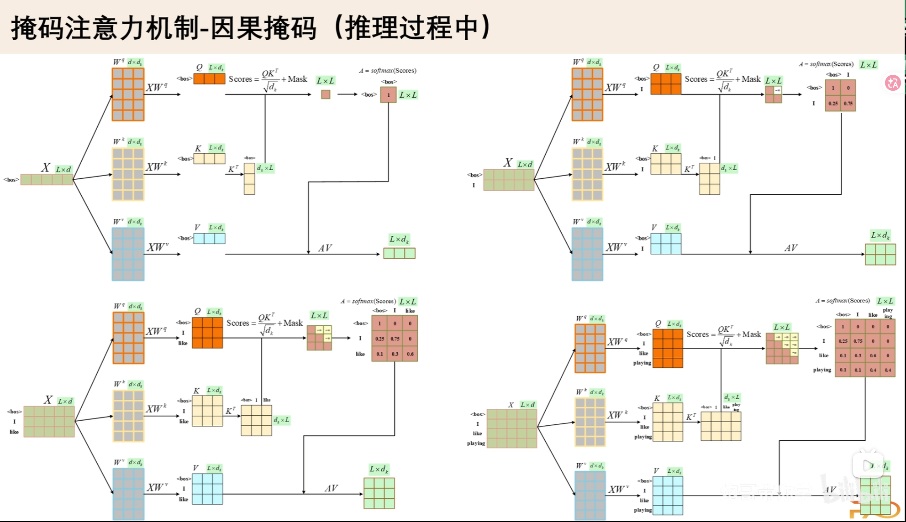
</div>

#### 交叉注意力机制（Cross-Attention）
> 交叉注意力机制是一种跨序列信息交互方法，它使用当前序列的 Query 去匹配外部上下文序列的 Key，并根据得到的注意力权重聚合对应的 Value，从而实现目标序列对源序列或条件信息的动态读取与对齐。
- **作用**：让一个序列在生成或理解时，去关注另一个序列的信息。在原始 Transformer 的 Encoder-Decoder 架构中，Decoder 会通过 Cross-Attention 读取 Encoder 的输出表示，从而在生成目标序列时参考源序列信息。
  - **Self-Attention**：同一个序列内部互相关注。
  - **Cross-Attention**：一个序列去关注另一个序列。
  ```text
  举例：假设做机器翻译：
  输入中文：我喜欢学习 AI
  输出英文：I like learning AI
  
  Encoder 先读懂中文：
  我 / 喜欢 / 学习 / AI
  
  Decoder 在生成英文时，每生成一个英文 token，都要回头看中文输入：
  生成 I        → 关注“我”
  生成 like     → 关注“喜欢”
  生成 learning → 关注“学习”
  生成 AI       → 关注“AI”
  ```
- **优点**：
  - **实现输入和输出对齐**：例如翻译中词与词之间的对齐。
  - **支持条件生成**：例如根据文本生成图像、根据图像生成文本。
  - **支持多模态融合**：不同模态可以通过 Cross-Attention 建立信息交互。
  - **信息来源清晰**：相比把所有 token 直接拼在一起，Cross-Attention 可以明确区分： 当前生成状态，外部条件信息。
- **$Q、K、V$ 在 Cross-Attention 中分别来自哪里？**：用当前生成状态作为查询，从另一个序列中检索并提取相关信息。
  - **$Q$**：查询序列的隐藏向量，通常来自 Decoder / 当前要生成的序列。
  - **$K$**：键序列的隐藏向量，通常来自 Encoder / 被参考的输入序列。
  - **$V$**：值序列的隐藏向量，通常来自 Encoder / 被参考的输入序列。
- **代码示例**：
  ```python
  import math
  import torch
  import torch.nn as nn
  import torch.nn.functional as F
  
  
  class CrossAttention(nn.Module):
      def __init__(self, dim, num_heads):
          super().__init__()
          assert dim % num_heads == 0
  
          self.dim = dim
          self.num_heads = num_heads
          self.head_dim = dim // num_heads
  
          self.q_proj = nn.Linear(dim, dim)
          self.k_proj = nn.Linear(dim, dim)
          self.v_proj = nn.Linear(dim, dim)
          self.out_proj = nn.Linear(dim, dim)
  
      def forward(self, query_states, context_states, context_mask=None):
          # query_states:   [B, T_q, C]
          # context_states: [B, T_kv, C]
  
          B, T_q, C = query_states.shape
          _, T_kv, _ = context_states.shape
  
          q = self.q_proj(query_states)
          k = self.k_proj(context_states)
          v = self.v_proj(context_states)
  
          # [B, T, C] -> [B, H, T, D]
          q = q.view(B, T_q, self.num_heads, self.head_dim).transpose(1, 2)
          k = k.view(B, T_kv, self.num_heads, self.head_dim).transpose(1, 2)
          v = v.view(B, T_kv, self.num_heads, self.head_dim).transpose(1, 2)
  
          # [B, H, T_q, T_kv]
          scores = torch.matmul(q, k.transpose(-2, -1)) / math.sqrt(self.head_dim)
  
          if context_mask is not None:
              # context_mask: [B, T_kv], True 表示需要屏蔽
              context_mask = context_mask[:, None, None, :]
              scores = scores.masked_fill(context_mask, float("-inf"))
  
          attn = F.softmax(scores, dim=-1)
  
          # [B, H, T_q, D]
          out = torch.matmul(attn, v)
  
          # [B, T_q, C]
          out = out.transpose(1, 2).contiguous().view(B, T_q, C)
          out = self.out_proj(out)
  
          return out
  
  
  B = 2
  T_q = 4
  T_kv = 6
  C = 32
  H = 4
  
  query_states = torch.randn(B, T_q, C)
  context_states = torch.randn(B, T_kv, C)
  
  cross_attn = CrossAttention(dim=C, num_heads=H)
  out = cross_attn(query_states, context_states)
  
  print(out.shape)  # torch.Size([2, 4, 32])
  ```
  <div>
    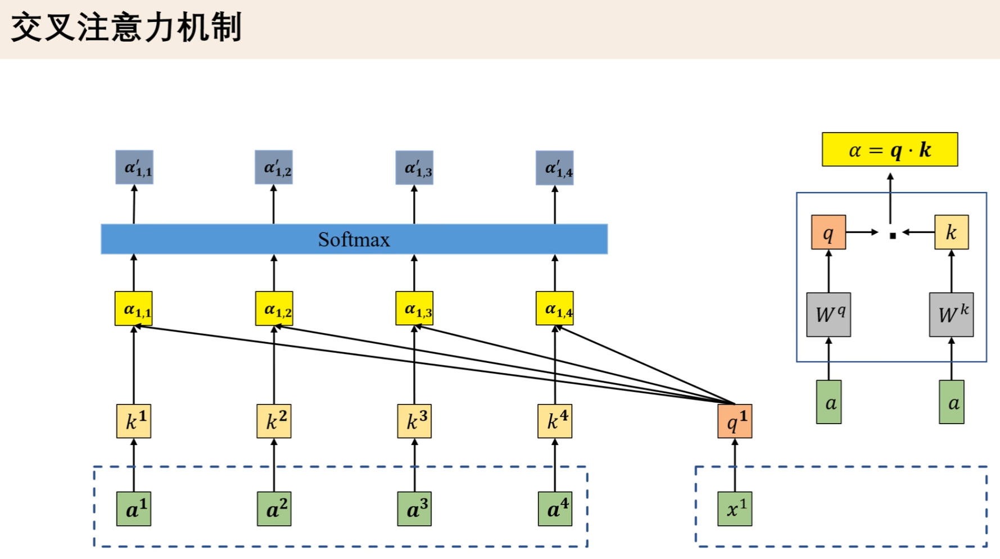
    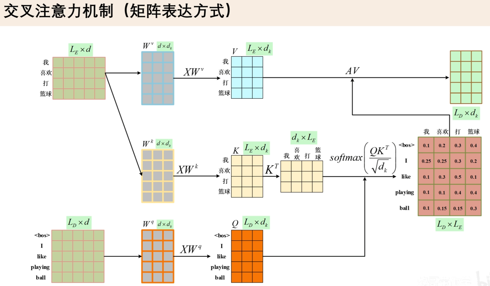
  </div>

### 层归一化（Layer Normalization）
> 层归一化是在单个样本的特征维度上计算均值与方差，并通过可学习缩放和平移参数重新调整表示分布的归一化方法；
> 在 Transformer 中，它主要用于稳定深层残差网络的训练过程，并改善 Attention 与 MLP 子层之间的数值传播。
- **作用**：在神经网络的每一层内部，对单个样本的特征维度做标准化，让数据分布更稳定，从而让模型更容易训练。
* **计算过程**：先把特征拉到均值约为 0、方差约为 1 的状态，再让模型自己学习合适的缩放和平移。
  1. 给定一个 token 的隐藏向量：$x = [x1, x2, ..., xC]$。
  2. LayerNorm 会先计算这个向量内部的均值和方差：$μ = mean(x), σ² = variance(x)$。
  3. 然后标准化：$\text{x_norm} = (x - μ) / sqrt(σ² + ε)$。
  4. 最后再做一个可学习的缩放和平移：$y = γ * x_norm + β$。 
  
  其中：
    - $μ$：$x$ 的均值，$μ = mean(x)$。
    - $σ²$：$x$ 的方差，$σ² = variance(x)$。
    - $ε$：防止除以 0 的小常数，$ε = 1e-5$。
    - $γ$：可学习缩放参数，$γ = 1$。
    - $β$：可学习偏移参数
- **LayerNorm 和 BatchNorm 的区别**：

  | 对比项 | LayerNorm | BatchNorm |
  |---|---|---|
  | 归一化对象 | 单个样本内部的特征维度 | 个 batch 内同一特征的统计量 |
  | 是否依赖 batch size | 不依赖 | 依赖 |
  | 常见场景 | NLP、Transformer、LLM |  CNN、ResNet、VGG等 |
  | 对变长序列是否友好 | 更友好 | 相对不方便 |
  | 训练 / 推理行为 | 通常一致 | 训练和推理统计方式不同 |

- **手写一个简化版 LayerNorm**：
  ```python
  import torch
  import torch.nn as nn
  
  
  class SimpleLayerNorm(nn.Module):
      def __init__(self, dim, eps=1e-5):
          super().__init__()
          self.eps = eps
          self.gamma = nn.Parameter(torch.ones(dim))
          self.beta = nn.Parameter(torch.zeros(dim))
  
      def forward(self, x):
          # x: [B, T, C]
          mean = x.mean(dim=-1, keepdim=True)
          var = x.var(dim=-1, keepdim=True, unbiased=False)
  
          x_norm = (x - mean) / torch.sqrt(var + self.eps)
  
          return self.gamma * x_norm + self.beta
  ```
  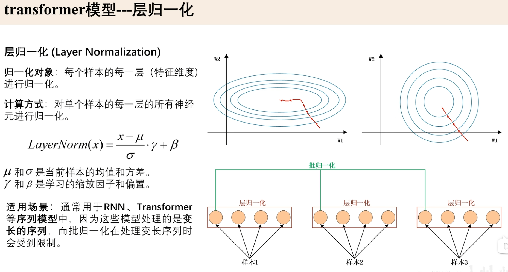

### 前馈神经网络（Feed Forward Neural Network, FFN）
> 前馈神经网络是一个逐位置应用的非线性特征变换模块，通常通过升维、激活或门控、降维的结构增强每个 token 表示的表达能力，并与 Self-Attention 共同构成 Transformer Block 的核心计算单元。
- **作用**：信息只从输入层一路向前传到输出层，中间不形成循环或记忆状态的神经网络。负责对每个 token 自己的特征表示做进一步加工和非线性变换。
  - Self-Attention：让 token 之间互相交换信息 --- 负责“看别人”。
  - FFN：每个 token 自己的特征表示做进一步加工和非线性变换，FFN 负责 “处理自己”
- **更强的非线性表达能力**：FFN 通过 “升维 — 非线性 — 降维”，增强每个 token 的特征表达能力。
  - 1. **升维**：把 token 表示展开到更大的特征空间，让模型有更多中间特征可以组合。
  - 2. **激活函数**：引入非线性，让模型能够学习更复杂的函数。
  - 3. **降维**：把处理后的信息压回原来的 hidden dimension，方便残差连接和下一层继续处理。
- **FFN 是 “逐位置” 应用的**：它对每个 token 独立使用同一套参数。
  ```text
  输入是：
  我 / 喜欢 / 学习 / AI
  
  FFN 会分别处理：
  FFN(我)
  FFN(喜欢)
  FFN(学习)
  FFN(AI)
  ```
  - 每个位置的 FFN 参数相同，但每个 token 的输入向量不同，所以输出也不同。
  - 它不会直接让 token 之间交流；token 之间的信息交流主要由 Attention 完成。
- **代码案例**：
  ```python
  import torch
  import torch.nn as nn
  import torch.nn.functional as F


  class FeedForward(nn.Module):
    def __init__(self, dim, hidden_dim):
        super().__init__()
        self.fc1 = nn.Linear(dim, hidden_dim)
        self.fc2 = nn.Linear(hidden_dim, dim)

    def forward(self, x):
        # x: [B, T, C]
        x = self.fc1(x)      # [B, T, hidden_dim]
        x = F.gelu(x)        # [B, T, hidden_dim]
        x = self.fc2(x)      # [B, T, C]
        return x


  B, T, C = 2, 5, 768
  hidden_dim = 3072
  
  x = torch.randn(B, T, C)
  ffn = FeedForward(C, hidden_dim)
  
  y = ffn(x)
  
  print(y.shape)  # torch.Size([2, 5, 768])
  ```
  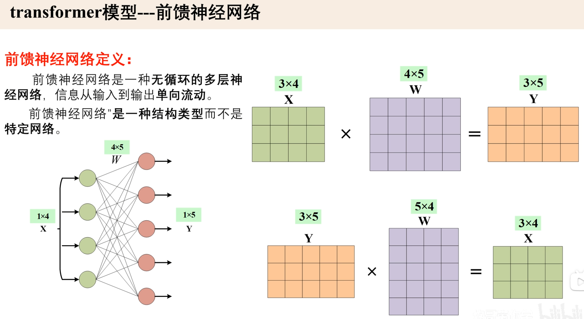

### 全连接层 / 线性层（Linear）
> Linear 层是神经网络中最基础的参数化仿射映射模块，它通过可学习权重矩阵和偏置将输入特征从 `in_features` 映射到 `out_features`；
> 在 Transformer 中，Linear 广泛用于 $Q/K/V$ 投影、注意力输出投影、前馈网络升降维以及词表 logits 生成。
- **作用**：把输入向量从一个维度映射到另一个维度。
- **在 Transformer 中的作用**：
  -  **$生成 Q、K、V$**：Multi-Head Attention 会把输入分别投影成 Query、Key、Value，再进行注意力计算.
      ```text
      Self-Attention 中，输入 x 会通过三个 Linear 层变成：
      Q = Linear_Q(x)
      K = Linear_K(x)
      V = Linear_V(x)
  
      也就是：
      q = q_proj(x)
      k = k_proj(x)
      v = v_proj(x)
      ```
  -  **Attention 输出投影**：融合多个 attention head 的结果，并映射回模型隐藏维度。
      ```text
      Self-Attention 中，输出会通过一个 Linear 层变成：
      o = Linear_O(attention_output)
      
      也就是：
      o = o_proj(attention_output)
      ```
 - **FFN / MLP 里的升维和降维**：
      ```text
      Transformer 的前馈神经网络通常包含两个 Linear：
      x → Linear1 → Activation → Linear2
      
      例如：
      self.fc1 = nn.Linear(dim, hidden_dim)
      self.fc2 = nn.Linear(hidden_dim, dim)
   
      作用是：
      先升维：dim → hidden_dim
      再降维：hidden_dim → dim
      ```
 - LM **LMM Head 输出词表概率**：为每个位置预测下一个 token 的概率分布。
      ```text
      在大语言模型最后，隐藏状态会通过 Linear 映射到词表大小：
      logits = lm_head(x)
   
      如果：
      x.shape = [B, T, hidden_dim]
      vocab_size = 32000
      则：
      logits.shape = [B, T, vocab_size]
      ```
-  **在 Transformer 中的常见位置**：
  
  | 位置  | Linear 名称 | 作用  |
  |---|---|---|
  | Attention | `q_proj` | 生成 Query |
  | Attention | `k_proj` | 生成 Key |
  | Attention | `v_proj` | 生成 Value |
  | Attention | `o_proj` | 融合多头输出 |
  | FFN / MLP | `up_proj / fc1` | 升维  |
  | FFN / MLP | `down_proj / fc2` | 降维 |
  | SwiGLU FFN | `gate_proj` | 生成门控信号  |
  | 输出层 | `lm_head` | 映射到词表 logits |

### Softmax 
> Softmax 是一种指数归一化函数，它将任意实数向量映射为概率单纯形上的分布；在分类模型中用于将 logits 转换为类别概率，
> 在 Transformer Attention 中用于将 token 间相关性分数归一化为注意力权重。
- **作用**：把一组任意实数转换成一组概率分布 --- 把输入向量映射到 [0, 1] 范围内，且所有元素的和为 1。
  ```text
  假设某个 token 对其他 token 的注意力分数是：
  scores = [2.0, 1.0, 0.1]
  
  经过 Softmax：
  attention_weights = [0.66, 0.24, 0.10]
  
  这表示当前 token：
  66% 关注第一个 token
  24% 关注第二个 token
  10% 关注第三个 token
  ```
- **核心公式**：${\displaystyle softmax(x_i) = \frac{e^{x_i}}{\sum_{j=1}^{n} e^{x_j}}}$
- **输出特点**：
  -  输出都大于 0：$softmax(x_i) > 0$。
  - 输出总和为 1：$\sum_{i=1}^{n} softmax(x_i) = 1$。
  - 保持相对大小关系：$若x1 > x2$，则$softmax(x1) > softmax(x2)$。
- **Softmax 和 Sigmoid 的区别**：

  | 对比项 | Softmax | Sigmoid |
  |---|---|---|
  | 输出范围 | 每个值在 0~1 | 每个值在 0~1 |
  | 输出总和 | 总和为 1 | 不要求总和为 1 |
  | 常见用途 | 多分类单选 | 二分类 / 多标签 |
  | 类别关系 | 类别互斥 | 类别可同时成立 |


--- 


## [示例代码](../../examples/eg_transformer_basic.py)
